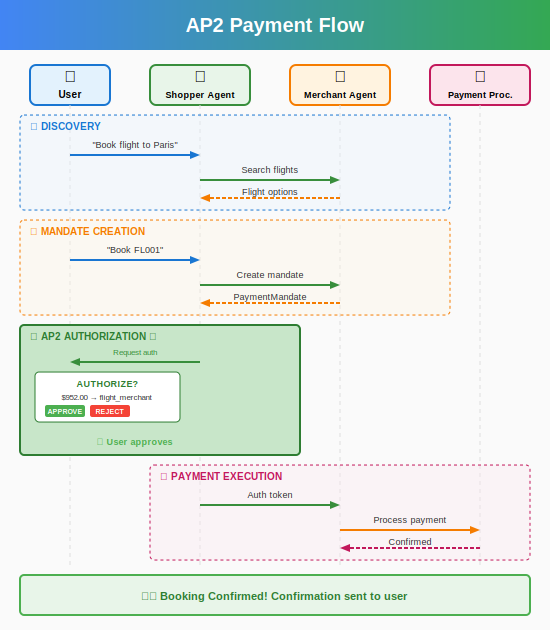
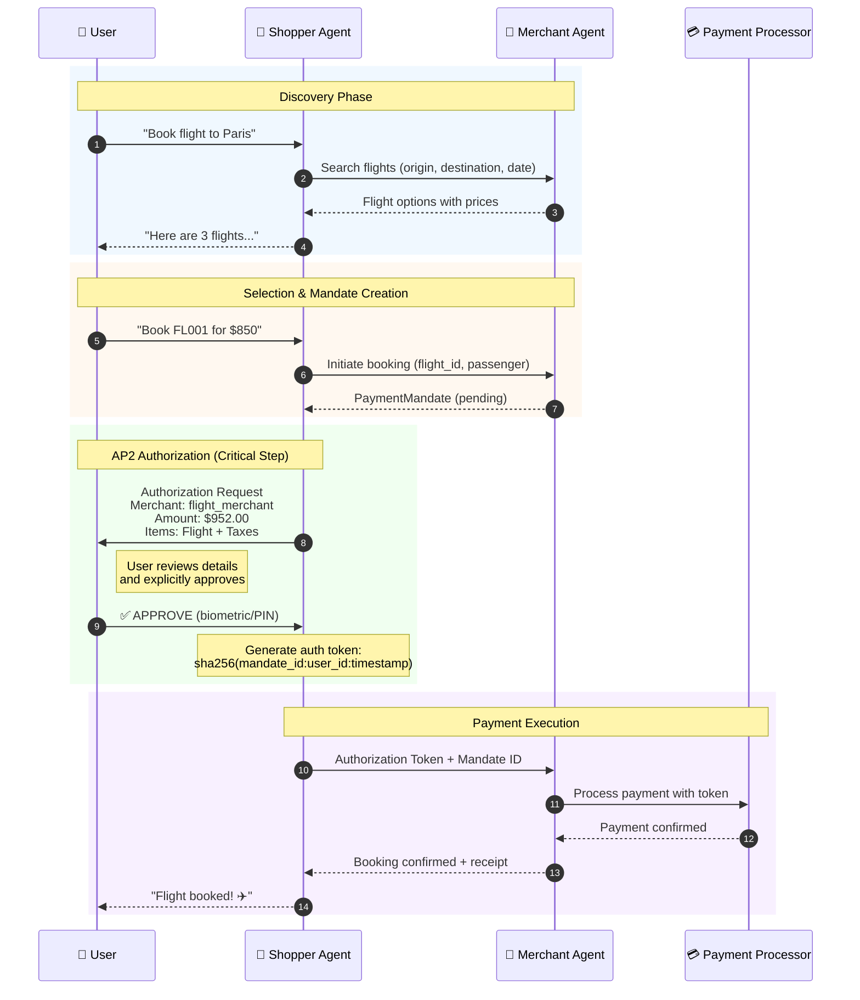

# AP2 Protocol - Key Concepts

## What is AP2?

**AP2 (Agent Payments Protocol)** is an open protocol that enables secure, reliable, and interoperable agent commerce. It solves a critical problem: **How can we trust AI agents to spend our money?**

---

## The Problem AP2 Solves

Without AP2, agent commerce has serious trust issues:

| Problem | Risk |
|---------|------|
| **Hallucinated Purchases** | Agent "imagines" a purchase that never happened |
| **Unauthorized Spending** | Agent makes purchases user didn't approve |
| **No Accountability** | When something goes wrong, who's responsible? |
| **No Proof of Intent** | User claims they never authorized; merchant disagrees |

---

## AP2 Core Principles

### 1. Verifiable Intent
Every payment requires **cryptographic proof** that the user authorized it.

```
User Intent → Cryptographic Token → Verifiable Authorization
```

### 2. Clear Accountability
Complete **audit trail** from user intent to completed transaction.

### 3. User Control
Users **always** explicitly authorize payments. No silent charges.

---

## Protocol Stack

```
┌─────────────────────────────────────────┐
│   AP2  - Agent Payments Protocol        │  ← Payment authorization
├─────────────────────────────────────────┤
│   A2A  - Agent-to-Agent Protocol        │  ← Multi-agent communication
├─────────────────────────────────────────┤
│   MCP  - Model Context Protocol         │  ← Tools & APIs
├─────────────────────────────────────────┤
│   ADK  - Agent Development Kit          │  ← Agent framework
└─────────────────────────────────────────┘
```

---

## AP2 Roles

| Role | Description | Example |
|------|-------------|---------|
| **Shopper** | Acts on behalf of user to find/purchase | Travel booking agent |
| **Merchant** | Sells goods/services | Flight booking service |
| **Credentials Provider** | Verifies user identity | Identity service |
| **Payment Processor** | Handles actual payment | Stripe, PayPal |

---

## The Payment Mandate

A **PaymentMandate** is the core AP2 data structure. It represents the user's authorization for a payment.

### Mandate Lifecycle

```
┌──────────┐     ┌────────────┐     ┌────────────┐     ┌───────────┐
│ PENDING  │ ──► │ AUTHORIZED │ ──► │ PROCESSING │ ──► │ COMPLETED │
└──────────┘     └────────────┘     └────────────┘     └───────────┘
     │                                                        │
     └──────────────► CANCELLED / FAILED ◄────────────────────┘
```

### Mandate Structure

```python
PaymentMandate:
  ├── mandate_id          # Unique identifier
  ├── Parties:
  │   ├── shopper_agent_id
  │   ├── merchant_agent_id
  │   └── user_id
  ├── Payment Details:
  │   ├── line_items[]    # What's being purchased
  │   ├── currency
  │   └── total_amount
  ├── Authorization:
  │   ├── status          # PENDING → AUTHORIZED → COMPLETED
  │   ├── user_authorization_token  # Cryptographic proof
  │   └── authorization_timestamp
  └── Audit Trail:
      ├── created_at
      ├── merchant_reference
      └── description
```

---

## AP2 Payment Flow

### Visual Diagram



### Sequence Diagram



### ASCII Diagram

```
┌──────────────────────────────────────────────────────────────────┐
│                        AP2 PAYMENT FLOW                          │
└──────────────────────────────────────────────────────────────────┘

   USER                 SHOPPER AGENT           MERCHANT AGENT
    │                        │                        │
    │  "Book flight to Paris"│                        │
    │───────────────────────►│                        │
    │                        │                        │
    │                        │   Search flights       │
    │                        │───────────────────────►│
    │                        │                        │
    │                        │   Flight options       │
    │                        │◄───────────────────────│
    │                        │                        │
    │   "Here are options"   │                        │
    │◄───────────────────────│                        │
    │                        │                        │
    │   "Book FL001"         │                        │
    │───────────────────────►│                        │
    │                        │                        │
    │                        │   Create mandate       │
    │                        │───────────────────────►│
    │                        │                        │
    │                        │   PaymentMandate       │
    │                        │◄───────────────────────│
    │                        │                        │
    │   ┌─────────────────────────────────────────┐   │
    │   │  AP2 AUTHORIZATION REQUEST              │   │
    │   │  ─────────────────────────────────────  │   │
    │   │  Merchant: flight_merchant_agent        │   │
    │   │  Amount: USD 952.00                     │   │
    │   │  Items:                                 │   │
    │   │    - Flight FL001: SFO → CDG ($850)     │   │
    │   │    - Taxes and fees ($102)              │   │
    │   │                                         │   │
    │   │  [APPROVE]  [REJECT]                    │   │
    │   └─────────────────────────────────────────┘   │
    │                        │                        │
    │   User clicks APPROVE  │                        │
    │───────────────────────►│                        │
    │                        │                        │
    │                        │   Auth token + mandate │
    │                        │───────────────────────►│
    │                        │                        │
    │                        │   Booking confirmed    │
    │                        │◄───────────────────────│
    │                        │                        │
    │   "Booking complete!"  │                        │
    │◄───────────────────────│                        │
    │                        │                        │
```

---

## Authorization Token

The **authorization token** is cryptographic proof of user intent.

```python
# Token generation (simplified)
token_data = f"{mandate_id}:{user_id}:{timestamp}"
authorization_token = sha256(token_data).hexdigest()
```

In production, this would involve:
- Device-based signing (Secure Enclave, TPM)
- Biometric verification
- Hardware security modules

---

## Why This Matters

### For Users
- **Control**: You always know what you're paying for
- **Security**: Can't be charged without your explicit approval
- **Audit Trail**: Proof of every transaction you authorized

### For Merchants
- **Non-repudiation**: User can't claim they didn't authorize
- **Interoperability**: Works with any AP2-compliant agent
- **Trust**: Customers trust the payment process

### For Developers
- **Standard Protocol**: Build once, work with any AP2 agent
- **Clear Contracts**: Well-defined data structures and flows
- **Extensible**: Add new roles and capabilities

---

## Key Takeaways

1. **Never charge without authorization** - Every payment needs explicit user approval
2. **Cryptographic proof** - Tokens prove user intent, preventing disputes
3. **Clear audit trail** - Full traceability from intent to completion
4. **Interoperable** - Any AP2-compliant agents can transact together
5. **User always in control** - The human decides, the agent executes

---

## Resources

- [AP2 Specification](https://github.com/google-agentic-commerce/ap2)
- [ADK Documentation](https://google.github.io/adk-docs/)
- [A2A Protocol](https://google.github.io/A2A/)
